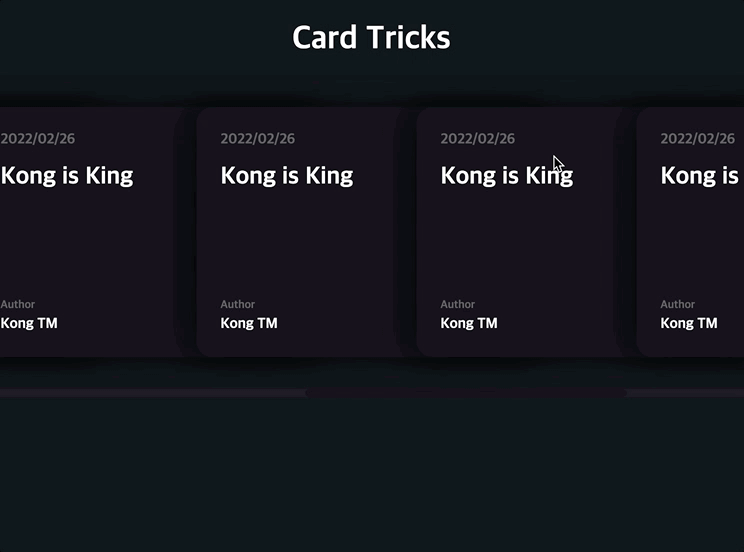

생각보다 순수 HTML 과 CSS로 작업할 수있는 부분이 많다.

JS로 DOM에 접근하여 각각의 style 도 조작할 수 있지만, 최대한 CSS선에서 해결하는게 코드양도 줄이고 좋다고 생각한다.

개인적 의견으로는 click하는 이벤트가 아닌이상은 모두 css로 해결할 수 있는 부분이다.

CSS로 클릭이벤트를 조작하고싶다면,checkbox를 이용한 trick이 있다.

기초적인 내용들은 각설하고 주요 Trick들을 설명하겠습니다.

---

## 레이아웃

```css
.card-list{
    display: flex;
    overflow-x: auto;
    scroll-snap-type: x mandatory;
}
 .card{
 	min-width: 350px;
    scroll-snap-align: center;
}
```

- 레이아웃은 간단히 flex를 이요하였고, 각 요소에 width를 지정해주어야한다. 그렇지 않으면 shrink되기 때문에 쪼그라든다.
- overflox-x: auto; 는 scroll로 주어도 상관없다.
- 고급 trick중하나는 scroll-snap-type이다. 말그대로 스크롤동작을 스냅하듯이 동작하도록 해주는 속성이다. 첫번째는 axis, 두번째는 mandatory속성을 주면 된다. 그리고서 자식 아이템들에게 scroll-snap-align 속성으로 어느부분에 걸리도록 할건지 정해준다. 보통 center, start, end가 있다.

## 스크롤바

```css
.card-list::-webkit-scrollbar {
  height: .5rem;
  background-color: $card-list-bg;
}
.card-list::-webkit-scrollbar-thumb{
  background-color: $card-bg;
  border-radius: 10px;
}
```

- 스크롤바는 직접 조작해주지않으면,브라우저의 기본 style이 적용되는데, 이쁘게 커스텀해주거나, 안보이게하는걸 선호한다.
- 가상선택자를 사용해서 scrollbar, scrollbar-thumb, scrollbar-track 세가지 속성에 접근할 수 있는데, 각각 너비, 바, 트랙 속성에 접근하도록 해준다. 근데 track을 사용하지않아도, 그냥 -webkit-scrollbar 여기서 적용해주면 트랙속성에 적용이되서, 두개만 알아도 된다.

## hover되었을때, 옆에있는 다른 요소들이 밀리게 하기

```css
.card:hover{
  transform: translateY(-.5rem);

}
.card:hover ~ .card{
  transform: translateX(1rem);
}
```

- 여기서 중요한점은 ~(물결)선택자이다. 물결선택자는 선택자 다음으로 오는 모든 형제요소를 선택하도록해준다. 이번 예제에서는 카드하나를 선택하면 그 뒤로 이어지는 모든 카드들이 선택되는것이다.

> 그런데 이렇게만하면 카드가 겹쳐지지가 않는다.

## 카드겹치기

```css
.card:not(:first-child){
  margin-left: -130px;
}
```

- 카드가 겹치도록 하려면 전체적으로 왼쪽으로 밀어주면된다.
- 각 카드에 margin속성을 주면된다.

> 나는처음에 transformX(-130px)로 주었었는데, 원하는데로 카드가 겹치는 효과가 나지 않았다. translate속성은 element를 통째로 그만큼 이동시키는 것이기 떄문에, horizontal로 나열되어있을때, 다같이그냥 좌로1보 이동한거랑 같은 효과이다. 반면 Margin속성은 각자 자신의 영역을 기준으로 오른쪽 여백을 추가하기 때문에, 겹치는 효과를 줄수 있다.

## box-shadow

```css
box-shadow: none|h-offset v-offset blur spread color
```

- 그림자는 보통 가시적으로 확인하고 원하는 모양을 얻으려면 box-shadow generator사이트를 이용해서 만드는것이 좋고, 이미 괜찮은 그림자 효과들은 많이 공유가 되어있다. 하지만 간단한것 조차도 찾아쓸 필요는 없으니 이번에 한번 찾아보았다.
- 간단했다, 첫번째값부터 수평각도,수직각도,블러,번짐,색상 이다.